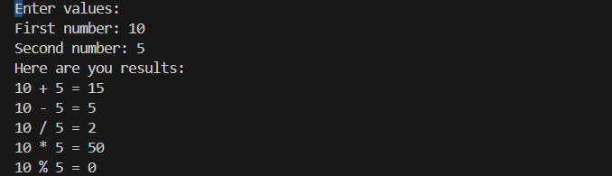

# Csharp

## Overview

This project how I can succesfly  use data types and arithmetic operation

Have a look at 'Program.cs' file and you can see how I have used :

* Console input/output
* Conversion between data types
* Arithmetic operations 

## Demo 

